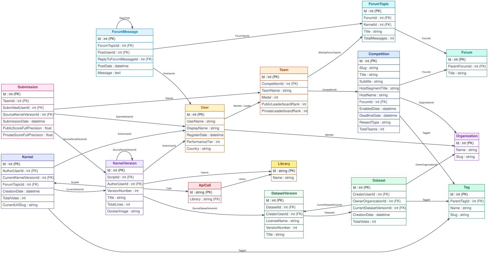

## Kaggle Knowledge Graph

[](https://github.com/IssunDB/kaggle-knowledge-graph/actions/workflows/tests.yml)
[](https://codecov.io/gh/IssunDB/kaggle-knowledge-graph)
[](https://github.com/IssunDB/kaggle-knowledge-graph/tree/main/examples)
[](https://github.com/IssunDB/kaggle-knowledge-graph/blob/main/LICENSE)

---

This repository contains code for building a knowledge graph from the [Meta Kaggle](https://www.kaggle.com/datasets/kaggle/meta-kaggle) dataset
(and loading it into [IssunDB](https://github.com/IssunDB/issun-db) which provides CLI and MCP interfaces for querying the data).

### Quickstart

#### Data

##### 1. Download Dataset

```bash
curl -L -o /path/to/meta-kaggle.zip\
https://www.kaggle.com/api/v1/datasets/download/kaggle/meta-kaggle
```

##### 2. Configure Environment Variables

```bash
export META_KAGGLE_DIR="/path/to/meta-kaggle"
```

#### Build and Launch

Build the Kaggle knowledge graph and launch the CLI or MCP server:

- `make graph-kc` builds the competition-centered knowledge graph from the Meta Kaggle dataset (needs `META_KAGGLE_CODE_DIR` for import and API call parsing).
- `make comp-cli` opens the competition knowledge graph in the IssunDB CLI.
- `make comp-mcp` runs the IssunDB MCP server for the competition knowledge graph.
- `make graph-kernel` builds the kernel-centered knowledge graph from the Meta Kaggle dataset (needs `META_KAGGLE_CODE_DIR` for import and API call parsing).
- `make kernel-cli` opens the kernel knowledge graph in the IssunDB CLI.
- `make kernel-mcp` runs the IssunDB MCP server for the kernel knowledge graph.

#### Publish the Graph as a Dataset

- `make hf-package HF_SNAPSHOT=YYYY-MM-DD` packages the staged competition graph as a Hugging Face dataset in `databases/hf-dataset`, with the Parquet files under `data/`, a dataset card, and a manifest of row counts and checksums.
- `make hf-upload HF_REPO_ID=<user>/<dataset>` uploads that directory to the Hugging Face Hub and tags it with the release version (log in first with `hf auth login`).
- `make help` shows all available Makefile targets.

#### MCP Server Configuration

To connect AI agents to the IssunDB MCP server, use the configuration template at [examples/mcp_config.json](examples/mcp_config.json):

```json
{
    "mcpServers": {
        "kaggle-comp-kg": {
            "command": "/path/to/kaggle-knowledge-graph/bin/issundb-mcp",
            "args": [
                "--db-path",
                "/path/to/kaggle-knowledge-graph/databases/comp-kg",
                "--map-size-gb",
                "8"
            ]
        }
    }
}
```

Replace `/path/to/kaggle-knowledge-graph` with the absolute path to your repository root directory.

#### Knowledge Graph Schema

<div align="center">
  <picture>
    
  </picture>
</div>

---

### Contributing

See [CONTRIBUTING.md](CONTRIBUTING.md) for details on how to make a contribution.

### License

This project is licensed under the [MIT License](LICENSE) except the knowledge graph data (built by the code in this repository), which
is subject to the [CC BY-NC-SA 4.0](https://creativecommons.org/licenses/by-nc-sa/4.0/) license.
